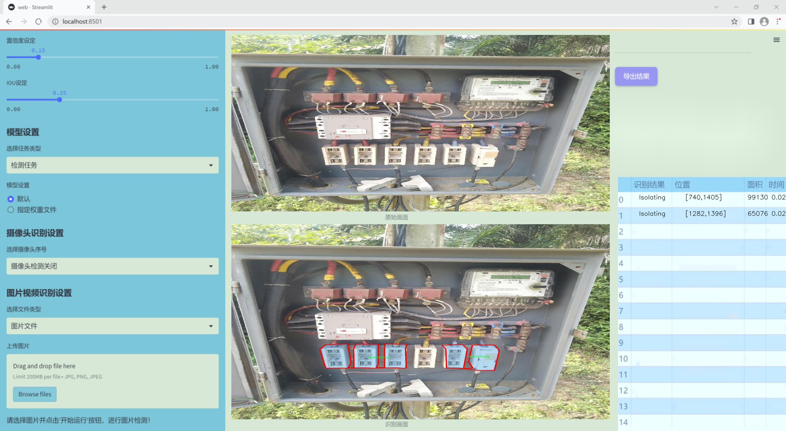
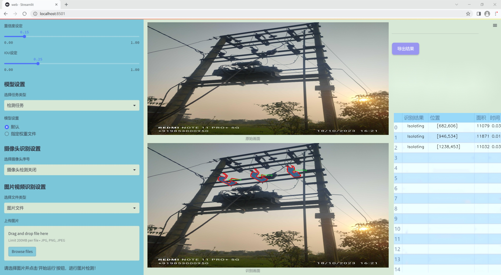
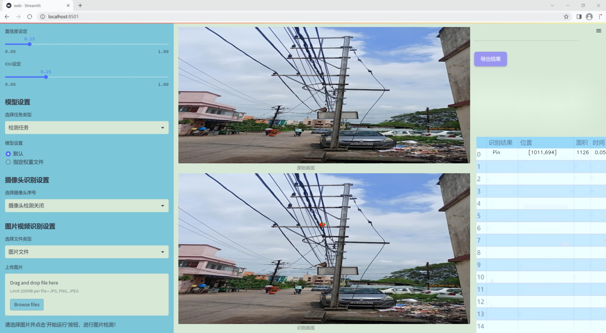
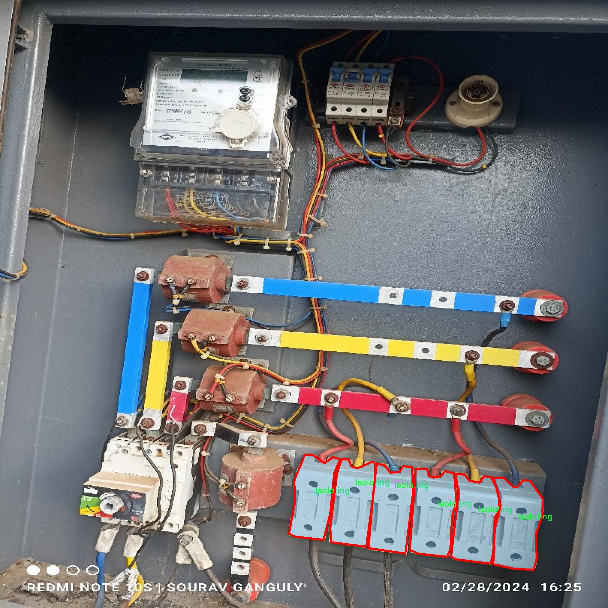
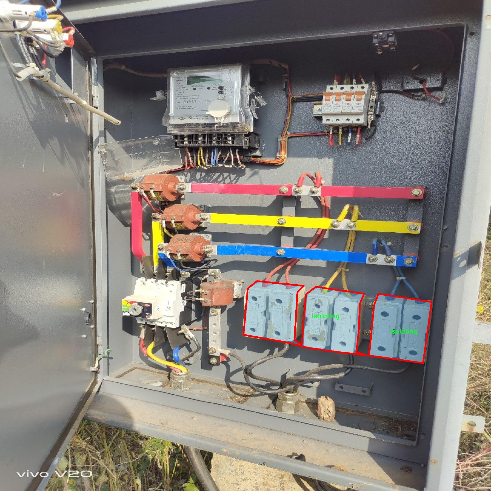
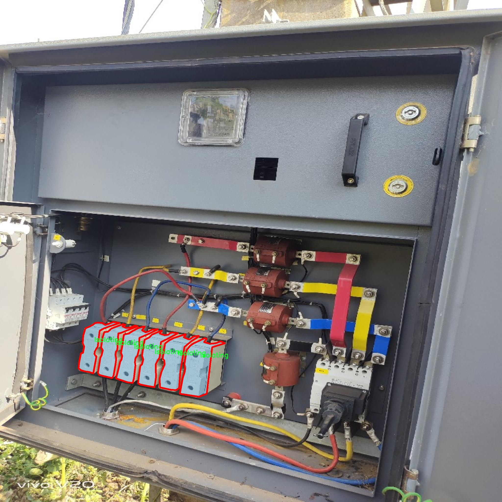
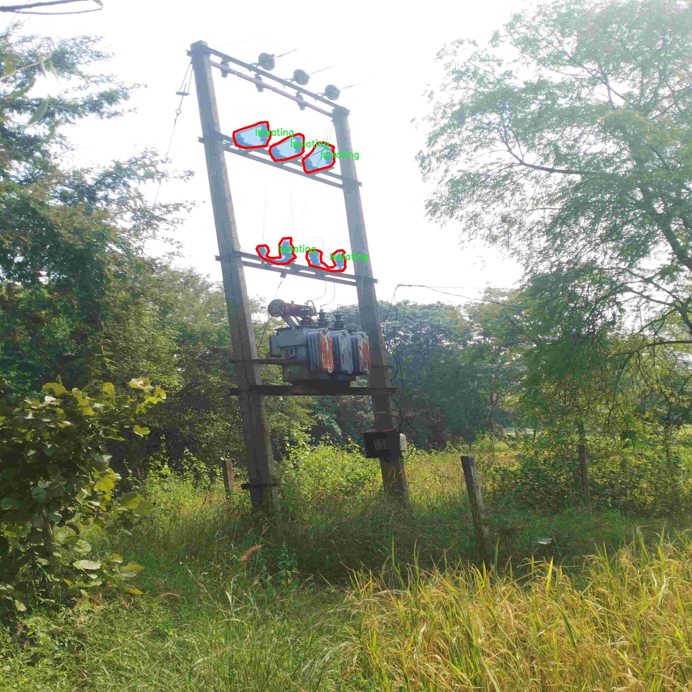
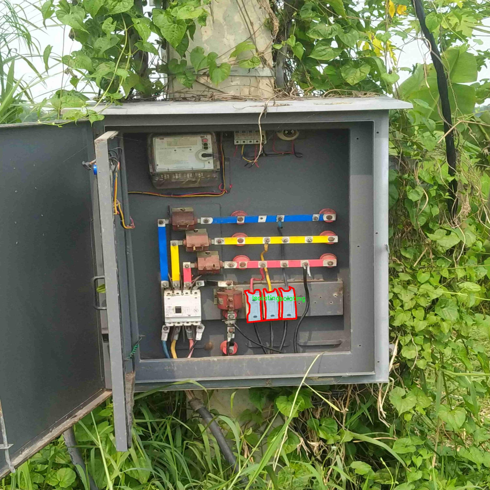

### 1.背景意义

研究背景与意义

在现代电气设备的设计与维护中，部件的准确识别与分类是确保系统安全性和可靠性的关键环节。随着电气设备的复杂性不断增加，传统的人工识别方法已难以满足高效性和准确性的要求。因此，基于深度学习的计算机视觉技术逐渐成为解决这一问题的重要手段。YOLO（You Only Look Once）系列模型因其实时性和高精度的特点，已广泛应用于目标检测和识别任务中。尤其是YOLOv11的改进版本，凭借其在特征提取和处理速度上的优势，为电气设备部件的自动识别提供了新的可能性。

本研究旨在基于改进的YOLOv11模型，构建一个高效的电气设备部件识别系统。该系统将利用一个包含1162张图像的数据集，涵盖了八类电气部件，包括Bushing、Disc、Disc-Pin、Isolating、La、Others、Pin和wall等。这些部件在电气设备的运行中扮演着重要角色，准确识别它们不仅有助于设备的故障诊断和维护，还能为设备的设计优化提供数据支持。

通过对数据集的深入分析与处理，研究将采用实例分割技术，以实现对电气部件的精确定位和分类。数据集中的图像经过预处理，确保了在不同环境条件下的鲁棒性。尽管未采用图像增强技术，但通过高分辨率的图像输入，系统仍能有效提取出关键特征，提升识别的准确性。

本研究的意义在于推动电气设备智能化管理的发展，提升设备维护的效率与安全性。通过构建基于YOLOv11的识别系统，能够为电气行业提供一种新型的智能解决方案，助力于实现更高水平的自动化与智能化管理。

### 2.视频效果

[2.1 视频效果](https://www.bilibili.com/video/BV1tNkFYZEtu/)

### 3.图片效果







##### [项目涉及的源码数据来源链接](https://kdocs.cn/l/cszuIiCKVNis)**

注意：本项目提供训练的数据集和训练教程,由于版本持续更新,暂不提供权重文件（best.pt）,请按照6.训练教程进行训练后实现上图演示的效果。

### 4.数据集信息

##### 4.1 本项目数据集类别数＆类别名

nc: 8
names: ['Bushing', 'Disc', 'Disc-Pin', 'Isolating', 'La', 'Others', 'Pin', 'wall']


该项目为【图像分割】数据集，请在【训练教程和Web端加载模型教程（第三步）】这一步的时候按照【图像分割】部分的教程来训练

##### 4.2 本项目数据集信息介绍

本项目数据集信息介绍

本项目旨在改进YOLOv11模型在电气设备部件识别系统中的应用，所使用的数据集围绕“Object_identification_Isolating”主题构建，专注于电气设备中的关键部件识别。该数据集包含8个类别，分别为：Bushing、Disc、Disc-Pin、Isolating、La、Others、Pin和wall。这些类别涵盖了电气设备中常见的部件，能够为模型提供丰富的训练样本，以提高其识别精度和效率。

在数据集的构建过程中，我们特别注重样本的多样性和代表性，以确保模型能够在各种环境和条件下进行有效识别。每个类别的样本均经过精心挑选，涵盖了不同的视角、光照条件和背景，从而增强模型的泛化能力。例如，Bushing和Pin类样本展示了不同类型和尺寸的绝缘子和连接件，而Disc和Disc-Pin类则提供了多种形状和材料的电气接触部件。这种多样性不仅提升了模型的训练效果，也为后续的实际应用奠定了坚实的基础。

此外，数据集中的“Isolating”类别专门针对电气设备中隔离部件的识别，具有重要的实用价值。通过对该类别的深入学习，模型能够更准确地识别和分类隔离装置，从而在电气安全和维护中发挥更大作用。总之，本项目的数据集为改进YOLOv11模型提供了丰富的训练素材，旨在提升电气设备部件的自动识别能力，推动智能电气设备的进一步发展与应用。











### 5.全套项目环境部署视频教程（零基础手把手教学）

[5.1 所需软件PyCharm和Anaconda安装教程（第一步）](https://www.bilibili.com/video/BV1BoC1YCEKi/?spm_id_from=333.999.0.0&vd_source=bc9aec86d164b67a7004b996143742dc)


[5.2 安装Python虚拟环境创建和依赖库安装视频教程（第二步）](https://www.bilibili.com/video/BV1ZoC1YCEBw?spm_id_from=333.788.videopod.sections&vd_source=bc9aec86d164b67a7004b996143742dc)

### 6.改进YOLOv11训练教程和Web_UI前端加载模型教程（零基础手把手教学）

[6.1 改进YOLOv11训练教程和Web_UI前端加载模型教程（第三步）](https://www.bilibili.com/video/BV1BoC1YCEhR?spm_id_from=333.788.videopod.sections&vd_source=bc9aec86d164b67a7004b996143742dc)


按照上面的训练视频教程链接加载项目提供的数据集，运行train.py即可开始训练



     Epoch   gpu_mem       box       obj       cls    labels  img_size
     1/200     20.8G   0.01576   0.01955  0.007536        22      1280: 100%|██████████| 849/849 [14:42<00:00,  1.04s/it]
               Class     Images     Labels          P          R     mAP@.5 mAP@.5:.95: 100%|██████████| 213/213 [01:14<00:00,  2.87it/s]
                 all       3395      17314      0.994      0.957      0.0957      0.0843

     Epoch   gpu_mem       box       obj       cls    labels  img_size
     2/200     20.8G   0.01578   0.01923  0.007006        22      1280: 100%|██████████| 849/849 [14:44<00:00,  1.04s/it]
               Class     Images     Labels          P          R     mAP@.5 mAP@.5:.95: 100%|██████████| 213/213 [01:12<00:00,  2.95it/s]
                 all       3395      17314      0.996      0.956      0.0957      0.0845

     Epoch   gpu_mem       box       obj       cls    labels  img_size
     3/200     20.8G   0.01561    0.0191  0.006895        27      1280: 100%|██████████| 849/849 [10:56<00:00,  1.29it/s]
               Class     Images     Labels          P          R     mAP@.5 mAP@.5:.95: 100%|███████   | 187/213 [00:52<00:00,  4.04it/s]
                 all       3395      17314      0.996      0.957      0.0957      0.0845


###### [项目数据集下载链接](https://kdocs.cn/l/cszuIiCKVNis)

### 7.原始YOLOv11算法讲解


###### YOLOv11改进方向

与YOLOv 10相比，YOLOv 11有了巨大的改进，包括但不限于：

  * 增强的模型结构：模型具有改进的模型结构，以获取图像处理并形成预测
  * GPU优化：这是现代ML模型的反映，GPU训练ML模型在速度和准确性上都更好。
  * 速度：YOLOv 11模型现在经过增强和GPU优化以用于训练。通过优化，这些模型比它们的前版本快得多。在速度上达到了25%的延迟减少！
  * 更少的参数：更少的参数允许更快的模型，但v11的准确性不受影响
  * 更具适应性：更多支持的任务YOLOv 11支持多种类型的任务、多种类型的对象和多种类型的图像。

###### YOLOv11功能介绍

Glenn Jocher和他的团队制作了一个令人敬畏的YOLOv 11迭代，并且在图像人工智能的各个方面都提供了YOLO。YOLOv 11有多种型号，包括：

  * 对象检测-在训练时检测图像中的对象
  * 图像分割-超越对象检测，分割出图像中的对象
  * 姿态检测-当用点和线训练时绘制一个人的姿势
  * 定向检测（OBB）：类似于对象检测，但包围盒可以旋转
  * 图像分类-在训练时对图像进行分类

使用Ultralytics Library，这些模型还可以进行优化，以：

  * 跟踪-可以跟踪对象的路径
  * 易于导出-库可以以不同的格式和目的导出
  * 多场景-您可以针对不同的对象和图像训练模型

此外，Ultralytics还推出了YOLOv 11的企业模型，该模型将于10月31日发布。这将与开源的YOLOv
11模型并行，但将拥有更大的专有Ultralytics数据集。YOLOv 11是“建立在过去的成功”的其他版本的之上。

###### YOLOv11模型介绍

YOLOv 11附带了边界框模型（无后缀），实例分割（-seg），姿态估计（-pose），定向边界框（-obb）和分类（-cls）。

这些也有不同的尺寸：纳米（n），小（s），中（m），大（l），超大（x）。


YOLOv11模型

###### YOLOv11与前版本对比

与YOLOv10和YOLOv8相比，YOLOv11在Ultralytics的任何帖子中都没有直接提到。所以我会收集所有的数据来比较它们。感谢Ultralytics：

**检测：**


YOLOv11检测统计


YOLOv10检测统计

其中，Nano的mAPval在v11上为39.5，v10上为38.5；Small为47.0 vs 46.3，Medium为51.5 vs
51.1，Large为53.4 vs 53.2，Extra Large为54.7vs
54.4。现在，这可能看起来像是一种增量增加，但小小数的增加可能会对ML模型产生很大影响。总体而言，YOLOv11以0.3
mAPval的优势追平或击败YOLOv10。

现在，我们必须看看速度。在延迟方面，Nano在v11上为1.55 , v10上为1.84，Small为2.46 v2.49，Medium为4.70
v4.74，Large为6.16 v7.28，Extra Large为11.31
v10.70。延迟越低越好。YOLOv11提供了一个非常低的延迟相比，除了特大做得相当差的前身。

总的来说，Nano模型是令人振奋的，速度更快，性能相当。Extra Large在性能上有很好的提升，但它的延迟非常糟糕。

**分割：**


YOLOV11 分割统计


YOLOV9 分割统计


YOLOV8 分割数据

总体而言，YOLOv 11上的分割模型在大型和超大型模型方面比上一代YOLOv 8和YOLOv 9做得更好。

YOLOv 9 Segmentation没有提供任何关于延迟的统计数据。比较YOLOv 11延迟和YOLOv 8延迟，发现YOLOv 11比YOLOv
8快得多。YOLOv 11将大量GPU集成到他们的模型中，因此期望他们的模型甚至比CPU测试的基准更快！

姿态估计：


YOLOV11姿态估计统计


YOLOV8姿态估计统计

YOLOv 11的mAP 50 -95统计量也逐渐优于先前的YOLOv 8（除大型外）。然而，在速度方面，YOLOv
11姿势可以最大限度地减少延迟。其中一些延迟指标是版本的1/4！通过对这些模型进行GPU训练优化，我可以看到指标比显示的要好得多。

**定向边界框：**


YOLOv11 OBB统计


YOLOv8 OBB统计

OBB统计数据在mAP
50上并不是很好，只有非常小的改进，在某种程度上小于检测中的微小改进。然而，从v8到v11的速度减半，这表明YOLOv11在速度上做了很多努力。

**最后，分类：**


YOLOv 11 CLS统计


YOLOv8 CLS统计

从v8到v11，准确性也有了微小的提高。然而，速度大幅上升，CPU速度更快的型号。


### 8.200+种全套改进YOLOV11创新点原理讲解

#### 8.1 200+种全套改进YOLOV11创新点原理讲解大全

由于篇幅限制，每个创新点的具体原理讲解就不全部展开，具体见下列网址中的改进模块对应项目的技术原理博客网址【Blog】（创新点均为模块化搭建，原理适配YOLOv5~YOLOv11等各种版本）

[改进模块技术原理博客【Blog】网址链接](https://gitee.com/qunmasj/good)


#### 8.2 精选部分改进YOLOV11创新点原理讲解

###### 这里节选部分改进创新点展开原理讲解(完整的改进原理见上图和[改进模块技术原理博客链接](https://gitee.com/qunmasj/good)【如果此小节的图加载失败可以通过CSDN或者Github搜索该博客的标题访问原始博客，原始博客图片显示正常】


### OREPA：在线卷积重参数化
卷积神经网络(CNNs)已经在许多计算机视觉任务的应用成功，包括图像分类、目标检测、语义分割等。精度和模型效率之间的权衡也已被广泛讨论。

一般来说，一个精度较高的模型通常需要一个更复杂的块，一个更宽或更深的结构。然而，这样的模型总是太重，无法部署，特别是在硬件性能有限、需要实时推理的场景下。考虑到效率，更小、更紧凑和更快的模型自然是首选。

为了获得一个部署友好且高精度的模型，有研究者提出了基于结构重参数化的方法来释放性能。在这些方法中，模型在训练阶段和推理阶段有不同的结构。具体来说，使用复杂的训练阶段拓扑，即重参数化的块，来提高性能。训练结束后，通过等效变换将一个复杂的块重参为成一个单一的线性层。重参后的模型通常具有一个整洁架构模型，例如，通常是一个类似VGG的或一个类似ResNet的结构。从这个角度来看，重参化策略可以在不引入额外的推理时间成本的情况下提高模型的性能。


BN层是重构模型的关键组成部分。在一个重新解析块(图1(b))中，在每个卷积层之后立即添加一个BN层。可以观察到，去除这些BN层会导致的性能退化。然而，当考虑到效率时，这种BN层的使用出乎意料地在训练阶段带来了巨大的计算开销。在推理阶段，复杂的块可以被压缩成一个卷积层。但是，在训练过程中，BN层是非线性的，也就是说，它们将特征映射除以它的标准差，这就阻止了合并整个块。因此，存在大量的中间计算操作(large FLOPS)和缓冲特征映射(high memory usage)。更糟糕的是，这么高的训练预算使得很难探索更复杂和可能更强的重参块。很自然地，下面的问题就出现了：

为什么标准化在重参中这么重要？

通过分析和实验，作者认为BN层中的尺度因子最重要，因为它们能够使不同分支的优化方向多样化。

基于观察结果，作者提出了在线重参化(OREPA)(图1(c))，这是一个两阶段的pipeline，使之能够简化复杂的training-time re-param block。

在第一阶段，block linearization，去除所有的非线性BN层，并引入线性缩放层。这些层与BN层具有相似的性质，因此它们使不同分支的优化多样化。此外，这些层都是线性的，可以在训练过程中合并成卷积层。

第二阶段，block squeezing，将复杂的线性块简化为单一的卷积层。OREPA通过减少由中间计算层引起的计算和存储开销，显著降低了训练成本，对性能只有非常小的影响。

此外，高效化使得探索更复杂的重参化拓扑成为可能。为了验证这一点，作者进一步提出了几个重参化的组件，以获得更好的性能。

在ImageNet分类任务上评估了所提出的OREPA。与最先进的修复模型相比，OREPA将额外的训练时间GPU内存成本降低了65%到75%，并将训练过程加快了1.5-2.3倍。同时，OREPA-ResNet和OREPA-VGG的性能始终优于+0.2%∼+0.6%之前的DBB和RepVGG方法。同时作者还评估了在下游任务上的OREPA，即目标检测和语义分割。作者发现OREPA可以在这些任务上也可以带来性能的提高。

提出了在线卷积重参化(OREPA)策略，这极大地提高了重参化模型的训练效率，并使探索更强的重参化块成为可能；

通过对重参化模型工作机制的分析，用引入的线性尺度层代替BN层，这仍然提供了不同的优化方向，并保持了表示能力;

在各种视觉任务上的实验表明，OREPA在准确性和训练效率方面都优于以前的重参化模型(DBB/RepVGG)。


#### 结构重参化
结构重参化最近被重视并应用于许多计算机视觉任务，如紧凑模型设计、架构搜索和剪枝。重参化意味着不同的架构可以通过参数的等价转换来相互转换。例如，1×1卷积的一个分支和3×3卷积的一个分支，可以转移到3×3卷积的单个分支中。在训练阶段，设计了多分支和多层拓扑来取代普通的线性层(如conv或全连接层)来增强模型。Cao等讨论了如何在训练过程中合并深度可分离卷积核。然后在推理过程中，将训练时间的复杂模型转移到简单模型中，以便于更快的推理。

在受益于复杂的training-time拓扑，同时，当前的重参化方法训练使用不可忽略的额外计算成本。当块变得更复杂以变得更强的表示时，GPU内存利用率和训练时间将会越来越长，最终走向不可接受。与以往的重参化方法不同，本文更多地关注训练成本。提出了一种通用的在线卷积重参化策略，使training-time的结构重参化成为可能。


#### Normalization
BN被提出来缓解训练非常深度神经网络时的梯度消失问题。人们认为BN层是非常重要的，因为它们平滑了损失。最近关于无BN神经网络的研究声称，BN层并不是不可或缺的。通过良好的初始化和适当的正则化，可以优雅地去除BN层。

对于重参化模型，作者认为重参化块中的BN层是关键的。无BN的变体将会出现性能下降。然而，BN层是非线性的，也就是说，它们将特征图除以它的标准差，这阻止了在线合并块。为了使在线重参化可行，作者去掉了重参块中的所有BN层，并引入了BN层的线性替代方法，即线性缩放层。

#### 卷积分解
标准卷积层计算比较密集，导致大的FLOPs和参数量。因此，卷积分解方法被提出，并广泛应用于移动设备的轻量化模型中。重参化方法也可以看作是卷积分解的某种形式，但它更倾向于更复杂的拓扑结构。本文的方法的不同之处在于，在kernel-level上分解卷积，而不是在structure level。

#### 在线重参化
在本节中，首先，分析了关键组件，即重参化模型中的BN层，在此基础上提出了在线重参化(OREPA)，旨在大大减少再参数化模型的训练时间预算。OREPA能够将复杂的训练时间块简化为一个卷积层，并保持了较高的精度。

OREPA的整体pipeline如图所示，它包括一个Block Linearization阶段和一个Block Squeezing阶段。


参考该博客通过分析多层和多分支结构的优化多样性，深入研究了重参化的有效性，并证明了所提出的线性缩放层和BN层具有相似的效果。

最后，随着训练预算的减少，进一步探索了更多的组件，以实现更强的重参化模型，成本略有增加。

#### 重参化中的Normalization
作者认为中间BN层是重参化过程中多层和多分支结构的关键组成部分。以SoTA模型DBB和RepVGG为例，去除这些层会导致严重的性能下降，如表1所示。


这种观察结果也得到了Ding等人的实验支持。因此，作者认为中间的BN层对于重参化模型的性能是必不可少的。

然而，中间BN层的使用带来了更高的训练预算。作者注意到，在推理阶段，重参化块中的所有中间操作都是线性的，因此可以合并成一个卷积层，从而形成一个简单的结构。

但在训练过程中，BN层是非线性的，即它们将特征映射除以其标准差。因此，中间操作应该单独计算，这将导致更高的计算和内存成本。更糟糕的是，如此高的成本将阻止探索更强大的训练模块。

#### Block Linearization
如3.1中所述，中间的BN层阻止了在训练过程中合并单独的层。然而，由于性能问题，直接删除它们并不简单。为了解决这一困境，作者引入了channel级线性尺度操作作为BN的线性替代方法。

缩放层包含一个可学习的向量，它在通道维度中缩放特征映射。线性缩放层具有与BN层相似的效果，它们都促进多分支向不同的方向进行优化，这是重参化时性能提高的关键。除了对性能的影响外，线性缩放层还可以在训练过程中进行合并，使在线重参化成为可能。


基于线性缩放层，作者修改了重参化块，如图所示。具体来说，块的线性化阶段由以下3个步骤组成：

首先，删除了所有的非线性层，即重参化块中的BN层

其次，为了保持优化的多样性，在每个分支的末尾添加了一个缩放层，这是BN的线性替代方法

最后，为了稳定训练过程，在所有分支的添加后添加一个BN层。

一旦完成线性化阶段，在重参化块中只存在线性层，这意味着可以在训练阶段合并块中的所有组件。

#### Block Squeezing
Block Squeezing步骤将计算和内存昂贵的中间特征映射上的操作转换为更经济的kernel上的操作。这意味着在计算和内存方面从减少到，其中、是特征图和卷积核的空间尺寸。

一般来说，无论线性重参化块是多么复杂，以下2个属性始终成立：

Block中的所有线性层，例如深度卷积、平均池化和所提出的线性缩放，都可以用带有相应参数的退化卷积层来表示;

Block可以由一系列并行分支表示，每个分支由一系列卷积层组成。

有了上述两个特性，如果可以将

多层（即顺序结构）

多分支（即并行结构）

简化为单一卷积，就可以压缩一个块。在下面的部分中，将展示如何简化顺序结构(图(a))和并行结构(图(b))。


### 9.系统功能展示

图9.1.系统支持检测结果表格显示

  图9.2.系统支持置信度和IOU阈值手动调节

  图9.3.系统支持自定义加载权重文件best.pt(需要你通过步骤5中训练获得)

  图9.4.系统支持摄像头实时识别

  图9.5.系统支持图片识别

  图9.6.系统支持视频识别

  图9.7.系统支持识别结果文件自动保存

  图9.8.系统支持Excel导出检测结果数据


### 10. YOLOv11核心改进源码讲解

#### 10.1 kagn_conv.py

以下是对代码的核心部分进行分析和详细注释的结果：

```python
# 引入必要的库
from functools import lru_cache
import torch
import torch.nn as nn
from torch.nn.functional import conv3d, conv2d, conv1d

# 定义一个通用的卷积层类 KAGNConvNDLayer，支持多维卷积
class KAGNConvNDLayer(nn.Module):
    def __init__(self, conv_class, norm_class, conv_w_fun, input_dim, output_dim, degree, kernel_size,
                 groups=1, padding=0, stride=1, dilation=1, dropout: float = 0.0, ndim: int = 2):
        super(KAGNConvNDLayer, self).__init__()
        
        # 初始化参数
        self.inputdim = input_dim  # 输入维度
        self.outdim = output_dim    # 输出维度
        self.degree = degree         # 多项式的阶数
        self.kernel_size = kernel_size  # 卷积核大小
        self.padding = padding       # 填充
        self.stride = stride         # 步幅
        self.dilation = dilation     # 膨胀
        self.groups = groups         # 分组卷积的组数
        self.base_activation = nn.SiLU()  # 基础激活函数
        self.conv_w_fun = conv_w_fun  # 卷积权重函数
        self.ndim = ndim             # 数据的维度
        self.dropout = None          # Dropout层初始化
        
        # 初始化Dropout层
        if dropout > 0:
            if ndim == 1:
                self.dropout = nn.Dropout1d(p=dropout)
            elif ndim == 2:
                self.dropout = nn.Dropout2d(p=dropout)
            elif ndim == 3:
                self.dropout = nn.Dropout3d(p=dropout)

        # 参数检查
        if groups <= 0:
            raise ValueError('groups must be a positive integer')
        if input_dim % groups != 0:
            raise ValueError('input_dim must be divisible by groups')
        if output_dim % groups != 0:
            raise ValueError('output_dim must be divisible by groups')

        # 创建基础卷积层和归一化层
        self.base_conv = nn.ModuleList([conv_class(input_dim // groups,
                                                   output_dim // groups,
                                                   kernel_size,
                                                   stride,
                                                   padding,
                                                   dilation,
                                                   groups=1,
                                                   bias=False) for _ in range(groups)])

        self.layer_norm = nn.ModuleList([norm_class(output_dim // groups) for _ in range(groups)])

        # 初始化多项式权重
        poly_shape = (groups, output_dim // groups, (input_dim // groups) * (degree + 1)) + tuple(
            kernel_size for _ in range(ndim))

        self.poly_weights = nn.Parameter(torch.randn(*poly_shape))  # 多项式权重
        self.beta_weights = nn.Parameter(torch.zeros(degree + 1, dtype=torch.float32))  # beta权重

        # 使用Kaiming均匀分布初始化卷积层权重
        for conv_layer in self.base_conv:
            nn.init.kaiming_uniform_(conv_layer.weight, nonlinearity='linear')

        nn.init.kaiming_uniform_(self.poly_weights, nonlinearity='linear')
        nn.init.normal_(
            self.beta_weights,
            mean=0.0,
            std=1.0 / ((kernel_size ** ndim) * self.inputdim * (self.degree + 1.0)),
        )

    # 计算beta值
    def beta(self, n, m):
        return (
            ((m + n) * (m - n) * n ** 2) / (m ** 2 / (4.0 * n ** 2 - 1.0))
        ) * self.beta_weights[n]

    # 计算Gram多项式
    @lru_cache(maxsize=128)  # 使用缓存避免重复计算
    def gram_poly(self, x, degree):
        p0 = x.new_ones(x.size())  # p0初始化为1

        if degree == 0:
            return p0.unsqueeze(-1)

        p1 = x  # p1初始化为x
        grams_basis = [p0, p1]  # 存储多项式基

        # 计算高阶多项式
        for i in range(2, degree + 1):
            p2 = x * p1 - self.beta(i - 1, i) * p0  # 递归计算
            grams_basis.append(p2)
            p0, p1 = p1, p2  # 更新p0和p1

        return torch.concatenate(grams_basis, dim=1)  # 返回多项式基

    # 前向传播
    def forward_kag(self, x, group_index):
        # 通过基础卷积层和激活函数处理输入
        basis = self.base_conv[group_index](self.base_activation(x))

        # 将x归一化到[-1, 1]范围
        x = torch.tanh(x).contiguous()

        if self.dropout is not None:
            x = self.dropout(x)  # 应用Dropout

        # 计算Gram多项式基
        grams_basis = self.base_activation(self.gram_poly(x, self.degree))

        # 通过卷积权重函数计算输出
        y = self.conv_w_fun(grams_basis, self.poly_weights[group_index],
                            stride=self.stride, dilation=self.dilation,
                            padding=self.padding, groups=1)

        # 通过归一化层和激活函数处理输出
        y = self.base_activation(self.layer_norm[group_index](y + basis))

        return y

    # 整体前向传播
    def forward(self, x):
        split_x = torch.split(x, self.inputdim // self.groups, dim=1)  # 按组分割输入
        output = []
        for group_ind, _x in enumerate(split_x):
            y = self.forward_kag(_x.clone(), group_ind)  # 对每组进行前向传播
            output.append(y.clone())
        y = torch.cat(output, dim=1)  # 合并输出
        return y

# 3D卷积层
class KAGNConv3DLayer(KAGNConvNDLayer):
    def __init__(self, input_dim, output_dim, kernel_size, degree=3, groups=1, padding=0, stride=1, dilation=1,
                 dropout: float = 0.0):
        super(KAGNConv3DLayer, self).__init__(nn.Conv3d, nn.InstanceNorm3d, conv3d,
                                              input_dim, output_dim,
                                              degree, kernel_size,
                                              groups=groups, padding=padding, stride=stride, dilation=dilation,
                                              ndim=3, dropout=dropout)

# 2D卷积层
class KAGNConv2DLayer(KAGNConvNDLayer):
    def __init__(self, input_dim, output_dim, kernel_size, degree=3, groups=1, padding=0, stride=1, dilation=1,
                 dropout: float = 0.0, norm_layer=nn.InstanceNorm2d):
        super(KAGNConv2DLayer, self).__init__(nn.Conv2d, norm_layer, conv2d,
                                              input_dim, output_dim,
                                              degree, kernel_size,
                                              groups=groups, padding=padding, stride=stride, dilation=dilation,
                                              ndim=2, dropout=dropout)

# 1D卷积层
class KAGNConv1DLayer(KAGNConvNDLayer):
    def __init__(self, input_dim, output_dim, kernel_size, degree=3, groups=1, padding=0, stride=1, dilation=1,
                 dropout: float = 0.0):
        super(KAGNConv1DLayer, self).__init__(nn.Conv1d, nn.InstanceNorm1d, conv1d,
                                              input_dim, output_dim,
                                              degree, kernel_size,
                                              groups=groups, padding=padding, stride=stride, dilation=dilation,
                                              ndim=1, dropout=dropout)
```

### 代码分析总结
1. **KAGNConvNDLayer** 是一个通用的多维卷积层，支持1D、2D和3D卷积。
2. **参数初始化** 包括输入输出维度、卷积核大小、分组数等，确保输入输出维度与分组数匹配。
3. **Gram多项式** 的计算使用了递归关系，利用缓存机制提高效率。
4. **前向传播** 过程中，输入数据经过基础卷积、激活函数、Gram多项式计算和归一化处理，最终输出结果。

这个程序文件 `kagn_conv.py` 定义了一系列用于卷积神经网络的自定义层，主要是基于 KAGN（Kochawongwat 等人提出的模型）的方法。程序中使用了 PyTorch 框架，具体实现了多维卷积层的功能，支持 1D、2D 和 3D 卷积。

首先，文件中定义了一个名为 `KAGNConvNDLayer` 的类，它是所有卷积层的基类。这个类的构造函数接收多个参数，包括输入和输出维度、卷积核大小、分组数、填充、步幅、扩张、丢弃率等。构造函数中会进行一些参数的验证，比如分组数必须是正整数，输入和输出维度必须能够被分组数整除。

在构造函数中，使用 `nn.ModuleList` 创建了多个卷积层和归一化层，分别对应于不同的分组。还定义了多项式权重和 beta 权重，这些权重是模型训练的关键参数。权重的初始化使用了 Kaiming 均匀分布，以帮助模型在训练初期更好地收敛。

`beta` 方法用于计算 beta 值，这个值与 Legendre 多项式的计算有关。`gram_poly` 方法则是计算 Legendre 多项式的核心，使用了缓存机制来避免重复计算，提高了效率。

`forward_kag` 方法是前向传播的实现，它首先对输入进行激活，然后通过基本卷积层进行线性变换。接着，输入会被归一化到 [-1, 1] 的范围，以便于计算 Legendre 多项式。然后，调用 `gram_poly` 方法计算多项式基，最后通过自定义的卷积函数进行卷积操作，并通过归一化层和激活函数处理输出。

`forward` 方法负责处理整个输入数据，它将输入数据按照分组进行切分，然后对每个分组调用 `forward_kag` 方法进行处理，最后将所有分组的输出拼接在一起。

接下来，文件中定义了三个子类：`KAGNConv3DLayer`、`KAGNConv2DLayer` 和 `KAGNConv1DLayer`，分别对应于 3D、2D 和 1D 的卷积层。这些子类通过调用基类 `KAGNConvNDLayer` 的构造函数，传入相应的卷积类和归一化类，简化了多维卷积层的实现。

总的来说，这个文件实现了一个灵活且功能强大的卷积层，可以根据不同的需求进行配置，适用于多种类型的深度学习任务。

#### 10.2 dyhead_prune.py

以下是代码中最核心的部分，并附上详细的中文注释：

```python
import torch
import torch.nn as nn
import torch.nn.functional as F

class DyReLU(nn.Module):
    """动态ReLU激活函数模块，支持动态调整激活函数的参数。"""
    def __init__(self, inp, reduction=4, lambda_a=1.0, use_bias=True):
        super(DyReLU, self).__init__()
        self.oup = inp  # 输出通道数
        self.lambda_a = lambda_a * 2  # 调整因子
        self.avg_pool = nn.AdaptiveAvgPool2d(1)  # 自适应平均池化层

        # 确定压缩比
        squeeze = inp // reduction
        self.fc = nn.Sequential(
            nn.Linear(inp, squeeze),  # 全连接层，将输入通道数压缩
            nn.ReLU(inplace=True),  # ReLU激活
            nn.Linear(squeeze, self.oup * 2),  # 再次全连接，输出两倍的通道数
            h_sigmoid()  # 使用h_sigmoid激活函数
        )

    def forward(self, x):
        """前向传播函数。"""
        b, c, h, w = x.size()  # 获取输入的形状
        y = self.avg_pool(x).view(b, c)  # 对输入进行平均池化
        y = self.fc(y).view(b, self.oup * 2, 1, 1)  # 通过全连接层得到动态参数

        # 分割动态参数
        a1, b1 = torch.split(y, self.oup, dim=1)
        a1 = (a1 - 0.5) * self.lambda_a + 1.0  # 调整a1
        out = x * a1 + b1  # 计算输出

        return out  # 返回动态调整后的输出

class DyDCNv2(nn.Module):
    """带有归一化层的可调变形卷积模块。"""
    def __init__(self, in_channels, out_channels, stride=1, norm_cfg=dict(type='GN', num_groups=16)):
        super().__init__()
        self.conv = ModulatedDeformConv2d(in_channels, out_channels, 3, stride=stride, padding=1)  # 可调变形卷积
        self.norm = build_norm_layer(norm_cfg, out_channels)[1] if norm_cfg else None  # 归一化层

    def forward(self, x, offset, mask):
        """前向传播函数。"""
        x = self.conv(x.contiguous(), offset, mask)  # 进行可调变形卷积
        if self.norm:
            x = self.norm(x)  # 进行归一化
        return x  # 返回卷积后的结果

class DyHeadBlock_Prune(nn.Module):
    """DyHead模块，包含三种类型的注意力机制。"""
    def __init__(self, in_channels, norm_type='GN'):
        super().__init__()
        self.spatial_conv_high = DyDCNv2(in_channels, in_channels)  # 高层特征卷积
        self.spatial_conv_mid = DyDCNv2(in_channels, in_channels)  # 中层特征卷积
        self.spatial_conv_low = DyDCNv2(in_channels, in_channels, stride=2)  # 低层特征卷积
        self.spatial_conv_offset = nn.Conv2d(in_channels, 27, 3, padding=1)  # 偏移和掩码卷积

    def forward(self, x, level):
        """前向传播函数。"""
        offset_and_mask = self.spatial_conv_offset(x[level])  # 计算偏移和掩码
        offset = offset_and_mask[:, :18, :, :]  # 提取偏移
        mask = offset_and_mask[:, 18:, :, :].sigmoid()  # 提取掩码并应用sigmoid

        mid_feat = self.spatial_conv_mid(x[level], offset, mask)  # 中层特征卷积
        sum_feat = mid_feat  # 初始化特征和

        # 处理低层特征
        if level > 0:
            low_feat = self.spatial_conv_low(x[level - 1], offset, mask)
            sum_feat += low_feat  # 累加低层特征

        # 处理高层特征
        if level < len(x) - 1:
            high_feat = F.interpolate(self.spatial_conv_high(x[level + 1], offset, mask), size=x[level].shape[-2:], mode='bilinear', align_corners=True)
            sum_feat += high_feat  # 累加高层特征

        return sum_feat  # 返回累加后的特征
```

### 代码核心部分解释：
1. **DyReLU**: 这是一个动态ReLU激活函数模块，可以根据输入动态调整激活参数。它通过自适应平均池化和全连接层计算出动态参数，并应用于输入。

2. **DyDCNv2**: 这是一个带有归一化层的可调变形卷积模块。它使用可调变形卷积对输入进行卷积操作，并可选择性地应用归一化。

3. **DyHeadBlock_Prune**: 这是一个包含多种注意力机制的模块。它通过计算偏移和掩码，结合不同层次的特征进行处理，以实现更好的特征融合。

以上是代码的核心部分和详细注释，帮助理解每个模块的功能和作用。

这个程序文件 `dyhead_prune.py` 实现了一个名为 DyHead 的神经网络模块，主要用于图像处理任务中的动态头部特征提取。文件中包含多个类和函数，以下是对其主要内容的讲解。

首先，文件导入了 PyTorch 及其相关模块，并尝试导入一些其他库，如 `mmcv` 和 `mmengine`，这些库提供了一些常用的深度学习功能和操作。如果导入失败，则会捕获异常但不做处理。

接下来，定义了一个 `_make_divisible` 函数，该函数用于确保输入的数值可以被指定的除数整除，并且不会低于一个最小值。这在构建网络时有助于确保特征图的尺寸符合特定要求。

文件中定义了多个激活函数的类，包括 `swish`、`h_swish` 和 `h_sigmoid`。这些类都继承自 `nn.Module`，并实现了 `forward` 方法，分别定义了不同的激活函数。这些激活函数在深度学习模型中用于引入非线性特性。

`DyReLU` 类是一个动态激活函数模块，具有可调节的参数和多个初始化选项。它通过自适应平均池化和全连接层生成动态的激活值，并可以选择性地使用空间注意力机制。该模块的前向传播方法根据输入特征图的特征生成不同的输出。

`DyDCNv2` 类实现了一个带有归一化层的可调变形卷积（Modulated Deformable Convolution），该卷积层能够根据输入特征动态调整卷积操作。它的构造函数接收输入和输出通道数、步幅以及归一化配置，并在前向传播中应用卷积和归一化。

`DyHeadBlock_Prune` 类是 DyHead 模块的核心部分，包含多个空间卷积层和注意力机制。它通过计算偏移量和掩码来实现动态卷积，并结合来自不同层次的特征进行融合。该类的构造函数初始化了卷积层和注意力模块，并在 `_init_weights` 方法中对卷积层的权重进行初始化。

在 `forward` 方法中，首先计算中间特征的偏移量和掩码，然后通过不同的卷积层提取特征，并根据注意力机制对特征进行加权求和。最终，返回经过任务注意力模块处理后的特征。

整体来看，这个文件实现了一个复杂的动态特征提取模块，适用于需要多层次特征融合和动态调整的深度学习任务，尤其是在计算机视觉领域。

#### 10.3 conv.py

以下是代码中最核心的部分，并附上详细的中文注释：

```python
import math
import torch
import torch.nn as nn

def autopad(k, p=None, d=1):  # kernel, padding, dilation
    """自动填充以确保输出形状与输入形状相同。"""
    if d > 1:
        # 计算实际的卷积核大小
        k = d * (k - 1) + 1 if isinstance(k, int) else [d * (x - 1) + 1 for x in k]
    if p is None:
        # 如果没有提供填充，则自动计算填充
        p = k // 2 if isinstance(k, int) else [x // 2 for x in k]
    return p

class Conv(nn.Module):
    """标准卷积层，包含卷积、批归一化和激活函数。"""

    default_act = nn.SiLU()  # 默认激活函数

    def __init__(self, c1, c2, k=1, s=1, p=None, g=1, d=1, act=True):
        """初始化卷积层，参数包括输入通道数、输出通道数、卷积核大小、步幅、填充、分组、扩张和激活函数。"""
        super().__init__()
        # 定义卷积层
        self.conv = nn.Conv2d(c1, c2, k, s, autopad(k, p, d), groups=g, dilation=d, bias=False)
        # 定义批归一化层
        self.bn = nn.BatchNorm2d(c2)
        # 根据输入参数选择激活函数
        self.act = self.default_act if act is True else act if isinstance(act, nn.Module) else nn.Identity()

    def forward(self, x):
        """前向传播：应用卷积、批归一化和激活函数。"""
        return self.act(self.bn(self.conv(x)))

class DWConv(Conv):
    """深度可分离卷积，使用深度卷积。"""

    def __init__(self, c1, c2, k=1, s=1, d=1, act=True):
        """初始化深度卷积，参数包括输入通道数、输出通道数、卷积核大小、步幅、扩张和激活函数。"""
        super().__init__(c1, c2, k, s, g=math.gcd(c1, c2), d=d, act=act)

class DSConv(nn.Module):
    """深度可分离卷积模块。"""

    def __init__(self, c1, c2, k=1, s=1, d=1, act=True) -> None:
        """初始化深度可分离卷积模块，包含深度卷积和逐点卷积。"""
        super().__init__()
        self.dwconv = DWConv(c1, c1, 3)  # 深度卷积
        self.pwconv = Conv(c1, c2, 1)     # 逐点卷积

    def forward(self, x):
        """前向传播：先通过深度卷积，再通过逐点卷积。"""
        return self.pwconv(self.dwconv(x))

class ConvTranspose(nn.Module):
    """转置卷积层。"""

    default_act = nn.SiLU()  # 默认激活函数

    def __init__(self, c1, c2, k=2, s=2, p=0, bn=True, act=True):
        """初始化转置卷积层，参数包括输入通道数、输出通道数、卷积核大小、步幅、填充、是否使用批归一化和激活函数。"""
        super().__init__()
        self.conv_transpose = nn.ConvTranspose2d(c1, c2, k, s, p, bias=not bn)
        self.bn = nn.BatchNorm2d(c2) if bn else nn.Identity()
        self.act = self.default_act if act is True else act if isinstance(act, nn.Module) else nn.Identity()

    def forward(self, x):
        """前向传播：应用转置卷积、批归一化和激活函数。"""
        return self.act(self.bn(self.conv_transpose(x)))

class ChannelAttention(nn.Module):
    """通道注意力模块。"""

    def __init__(self, channels: int) -> None:
        """初始化通道注意力模块，设置基本配置。"""
        super().__init__()
        self.pool = nn.AdaptiveAvgPool2d(1)  # 自适应平均池化
        self.fc = nn.Conv2d(channels, channels, 1, 1, 0, bias=True)  # 1x1卷积
        self.act = nn.Sigmoid()  # 激活函数

    def forward(self, x: torch.Tensor) -> torch.Tensor:
        """前向传播：计算通道注意力并应用于输入。"""
        return x * self.act(self.fc(self.pool(x)))

class SpatialAttention(nn.Module):
    """空间注意力模块。"""

    def __init__(self, kernel_size=7):
        """初始化空间注意力模块，设置卷积核大小。"""
        super().__init__()
        assert kernel_size in {3, 7}, "卷积核大小必须为3或7"
        padding = 3 if kernel_size == 7 else 1
        self.cv1 = nn.Conv2d(2, 1, kernel_size, padding=padding, bias=False)  # 卷积层
        self.act = nn.Sigmoid()  # 激活函数

    def forward(self, x):
        """前向传播：计算空间注意力并应用于输入。"""
        return x * self.act(self.cv1(torch.cat([torch.mean(x, 1, keepdim=True), torch.max(x, 1, keepdim=True)[0]], 1)))

class CBAM(nn.Module):
    """卷积块注意力模块。"""

    def __init__(self, c1, kernel_size=7):
        """初始化CBAM模块，设置输入通道和卷积核大小。"""
        super().__init__()
        self.channel_attention = ChannelAttention(c1)  # 通道注意力
        self.spatial_attention = SpatialAttention(kernel_size)  # 空间注意力

    def forward(self, x):
        """前向传播：依次应用通道注意力和空间注意力。"""
        return self.spatial_attention(self.channel_attention(x))
```

### 代码核心部分说明：
1. **autopad**：用于自动计算填充，以确保卷积操作后输出的形状与输入形状相同。
2. **Conv**：标准卷积层，包含卷积、批归一化和激活函数的组合。
3. **DWConv**：深度卷积，适用于深度可分离卷积的实现。
4. **DSConv**：深度可分离卷积模块，包含深度卷积和逐点卷积。
5. **ConvTranspose**：转置卷积层，通常用于上采样。
6. **ChannelAttention**：通道注意力机制，通过对通道进行加权来增强特征。
7. **SpatialAttention**：空间注意力机制，通过对空间位置进行加权来增强特征。
8. **CBAM**：结合通道和空间注意力的模块，提升特征表达能力。

这个程序文件 `conv.py` 定义了一系列用于卷积操作的模块，主要用于深度学习中的卷积神经网络（CNN）。文件中使用了 PyTorch 框架，并实现了多种卷积层和注意力机制。以下是对代码的详细说明。

首先，文件导入了必要的库，包括 `math`、`numpy` 和 `torch` 以及 `torch.nn`。接着，定义了一个名为 `autopad` 的函数，该函数用于自动计算卷积操作所需的填充，以确保输出的形状与输入的形状相同。

接下来，定义了多个卷积类。`Conv` 类实现了标准的卷积操作，包含卷积层、批归一化层和激活函数。构造函数中接受多个参数，如输入通道数、输出通道数、卷积核大小、步幅、填充、分组卷积和扩张等。`forward` 方法实现了卷积、批归一化和激活的顺序操作。

`Conv2` 类是 `Conv` 类的简化版本，增加了一个 1x1 的卷积层，以便在前向传播中融合两个卷积的输出。`LightConv` 类实现了一种轻量级卷积，结合了标准卷积和深度卷积（`DWConv`），用于提高计算效率。

`DWConv` 类实现了深度卷积，适用于每个输入通道独立进行卷积操作。`DSConv` 类则实现了深度可分离卷积，结合了深度卷积和逐点卷积的特点。

`DWConvTranspose2d` 类实现了深度转置卷积，而 `ConvTranspose` 类则实现了标准的转置卷积层，支持批归一化和激活函数。

`Focus` 类用于将空间信息聚焦到通道维度，通过对输入张量进行特定的切片和拼接，增加了卷积的输入通道数。`GhostConv` 类实现了 Ghost 卷积，通过主卷积和廉价操作来提高特征学习的效率。

`RepConv` 类是一个基础的重复卷积模块，支持训练和推理阶段的不同操作。它通过融合卷积和批归一化的参数来优化模型。

接下来，定义了几个注意力机制模块。`ChannelAttention` 类实现了通道注意力机制，通过对输入特征图进行全局平均池化和全连接层操作，生成通道权重。`SpatialAttention` 类实现了空间注意力机制，通过对输入特征图进行平均和最大池化，生成空间权重。

`CBAM` 类结合了通道注意力和空间注意力，形成一个完整的卷积块注意力模块，用于特征的重校准。

最后，`Concat` 类实现了张量的拼接操作，可以在指定的维度上将多个张量连接起来。

整体来看，这个文件实现了多种卷积和注意力机制模块，为构建复杂的卷积神经网络提供了基础组件。这些模块可以灵活组合，适用于各种计算机视觉任务。

#### 10.4 prepbn.py

以下是经过简化并注释的核心代码部分：

```python
import torch
import torch.nn as nn

# 自定义的批量归一化类
class RepBN(nn.Module):
    def __init__(self, channels):
        super(RepBN, self).__init__()
        # alpha 是一个可学习的参数，初始化为1
        self.alpha = nn.Parameter(torch.ones(1))
        # 使用一维批量归一化
        self.bn = nn.BatchNorm1d(channels)

    def forward(self, x):
        # 将输入的维度进行转置，以适应 BatchNorm1d 的输入格式
        x = x.transpose(1, 2)
        # 进行批量归一化，并加上 alpha 乘以原始输入
        x = self.bn(x) + self.alpha * x
        # 再次转置回原来的维度
        x = x.transpose(1, 2)
        return x

# 自定义的线性归一化类
class LinearNorm(nn.Module):
    def __init__(self, dim, norm1, norm2, warm=0, step=300000, r0=1.0):
        super(LinearNorm, self).__init__()
        # 注册一些缓冲区，用于训练过程中的状态管理
        self.register_buffer('warm', torch.tensor(warm))  # 预热步数
        self.register_buffer('iter', torch.tensor(step))   # 当前迭代步数
        self.register_buffer('total_step', torch.tensor(step))  # 总步数
        self.r0 = r0  # 初始比例
        self.norm1 = norm1(dim)  # 第一个归一化层
        self.norm2 = norm2(dim)  # 第二个归一化层

    def forward(self, x):
        if self.training:  # 训练模式
            if self.warm > 0:  # 如果还有预热步数
                self.warm.copy_(self.warm - 1)  # 减少预热步数
                x = self.norm1(x)  # 进行第一次归一化
            else:
                # 计算当前的 lambda 值，用于线性插值
                lamda = self.r0 * self.iter / self.total_step
                if self.iter > 0:
                    self.iter.copy_(self.iter - 1)  # 减少迭代步数
                x1 = self.norm1(x)  # 第一次归一化
                x2 = self.norm2(x)  # 第二次归一化
                # 线性插值
                x = lamda * x1 + (1 - lamda) * x2
        else:  # 测试模式
            x = self.norm2(x)  # 只进行第二次归一化
        return x
```

### 代码说明：
1. **RepBN 类**：
   - 该类实现了一种自定义的批量归一化方法，允许通过一个可学习的参数 `alpha` 来调整归一化的输出。
   - 在 `forward` 方法中，输入数据的维度被转置，以适应 `BatchNorm1d` 的要求，经过归一化后，再加上 `alpha` 乘以原始输入。

2. **LinearNorm 类**：
   - 该类实现了一种线性归一化方法，结合了两个不同的归一化层（`norm1` 和 `norm2`）。
   - 在训练过程中，使用预热阶段逐步引入 `norm1`，然后根据当前的迭代步数计算一个线性插值系数 `lambda`，在 `norm1` 和 `norm2` 之间进行加权。
   - 在测试模式下，只使用 `norm2` 进行归一化。

这个程序文件定义了两个神经网络模块，分别是 `RepBN` 和 `LinearNorm`，它们都是基于 PyTorch 框架构建的。

`RepBN` 类是一个自定义的批量归一化层，继承自 `nn.Module`。在初始化方法中，它接受一个参数 `channels`，用于指定输入数据的通道数。该类定义了一个可学习的参数 `alpha`，初始值为 1，并创建了一个标准的批量归一化层 `bn`。在前向传播方法 `forward` 中，输入张量 `x` 首先进行维度转置，将通道维移到最后，然后通过批量归一化层进行处理。处理后，结果与 `alpha` 乘以原始输入 `x` 相加，最后再进行一次维度转置以恢复原来的形状。这个模块的设计目的是在标准的批量归一化基础上引入一个可调的加权项，以增强模型的表达能力。

`LinearNorm` 类同样继承自 `nn.Module`，它的构造函数接受多个参数，包括 `dim`（输入的维度）、`norm1` 和 `norm2`（两个归一化函数）、`warm`（预热步数）、`step`（当前步数）和 `r0`（初始权重）。在初始化过程中，使用 `register_buffer` 方法注册了一些缓冲区变量，这些变量在模型训练过程中会保持其状态。前向传播方法 `forward` 的逻辑较为复杂：如果模型处于训练状态且预热步数大于 0，则执行第一次归一化 `norm1`，并将预热步数减一；否则，计算一个权重 `lamda`，它与当前迭代步数和总步数有关。接着，分别对输入 `x` 应用两个归一化操作 `norm1` 和 `norm2`，并根据计算出的权重将这两个结果进行线性组合。若模型不在训练状态，则直接使用 `norm2` 对输入进行归一化处理。

总体而言，这两个模块通过自定义的归一化方法和动态调整的权重，旨在提高神经网络的训练效果和稳定性。

### 11.完整训练+Web前端界面+200+种全套创新点源码、数据集获取


# [下载链接：https://mbd.pub/o/bread/Z5ybk59y](https://mbd.pub/o/bread/Z5ybk59y)